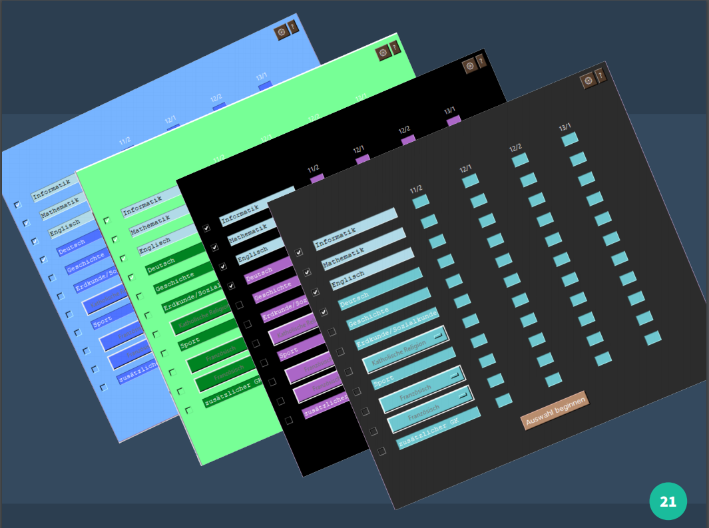

# MSS-Rechner

 **For an english description, click [here](#english-description).**

 ---
 
**Table of contents**
- [MSS-Rechner](#mss-rechner)
  - [Ein Programm zur Berechnung des Abiturschnitts!](#ein-programm-zur-berechnung-des-abiturschnitts)
  - [Ausführung](#ausführung)
  - [Startbildschirm](#startbildschirm)
  - [Der MSS-Rechner kommt in allen beliebigen Farben (inklusive Kaffee!)](#der-mss-rechner-kommt-in-allen-beliebigen-farben-inklusive-kaffee)
  - [English description](#english-description)
  - [Execution](#execution)
  - [Images](#images)
 ---

 ## Ein Programm zur Berechnung des Abiturschnitts!

Mit diesem Programm kann man bequem seinen Abiturschnitt ausrechnen,
selbst wenn man noch nicht sämtliche Noten hast, und das alles in unter
3 Minuten!
Das Programm richtet sich insbesondere an die Berechnungsvorschriften
in Rheinland-Pfalz, kann aber auch für andere
Bundesländer genutzt werden. Man wählt seine Kurse, trägt die entsprechenden Punktzahlen
ein und erhält die entsprechende Abiturnote oder optional eine Prognose, falls nicht
alle Noten eingetragen wurden.

## Ausführung
Zur bequemen Ausführung kann einfach die .exe-Datei im "exe"-Ordner gestartet werden.
Die .exe-Datei wurde mit pyinstaller erstellt.
Falls dies nicht möglich / nicht erwünscht ist,
kann auch "Controller.py" mit Python >3.5 ausgeführt werden.
Es sind keine weiteren Bibliotheken notwendig.
Beim Verschieben bitte den gesamten "exe"-Ordner verschieben, keine einzelnen Dateien.

## Startbildschirm

 

## Der MSS-Rechner kommt in allen beliebigen Farben (inklusive Kaffee!)

 

---

## English description
MSS-rechner is a small programm designed for students of the german
"Mainzer Studienstufe" (MSS, 11th-13th grade). This program enables them to quickly
and comfortably calculate their final graduation score, even if they
do not have all of the required grades yet. In the latter case a
forecast is calculated. This programm was mainly
designed for the state of Rheinland-Pfalz, because
the systems of the different states are not fully coherent.

## Execution
The program can be executed by running the .exe-file in the "exe"-folder. The .exe was
created using pyinstaller. If you do not want to run an .exe, you can just execute
"Controller.py" with Python >3.5. There are no further dependencies. 
When moving files, please move the entire "exe"-folder, not just single files.

## Screenshots
The initial window can be seen above. The MSS-Rechner comes in all possible colors (including coffee!).
