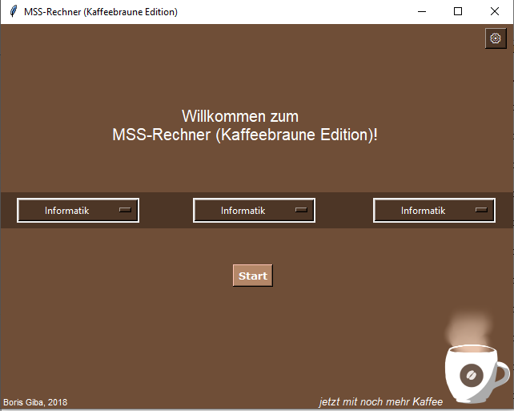

# mss_rechner
 Ein Programm zur Berechnung des Abiturschnitts!

 for an english description, click [here](#english-description)

Mit diesem Programm kann man bequem seinen Abiturschnitt ausrechnen,
selbst wenn man noch nicht sämtliche Noten hast, und das alles in unter
3 Minuten!
Das Programm richtet sich insbesondere an die Berechnungsvorschriften
in RLP, kann aber zur groben Überschlagsrechnung auch für andere
Länder genutzt werden.

## Ausführung
Zur bequemen Ausführung kann einfach die .exe-Datei im exe-Ordner gestartet werden.
Die .exe-Datei wurde mit pyinstaller erstellt.
Falls dies nicht möglich / nicht erwünscht sein sollte,
kann auch "Controller.py" mit Python >3.5 ausgeführt werden.
Es sollten keine weiteren Bibliotheken notwendig sein.
Beim Verschieben ist darauf zu achten, dass die anderen Dateien im exe-Ordner sich dabei im gleichen Verzeichnis befinden, wie die .exe-Datei!

## Startbildschirm

 

## Der MSS-Rechner kommt in allen beliebigen Farben (inklusive Kaffee!)

 

## English description
mss_rechner is a small programm designed for students of the german
"Mainzer Studienstufe" (MSS). This programm enables them to quickly
and comfortably calculate their final graduation score, even if they
do not have all of the required grades yet. This programm was mainly
designed for the state of Rheinland-Pfalz (Rhineland-Palatinate), because
the systems of the different states do not fully overlap.
